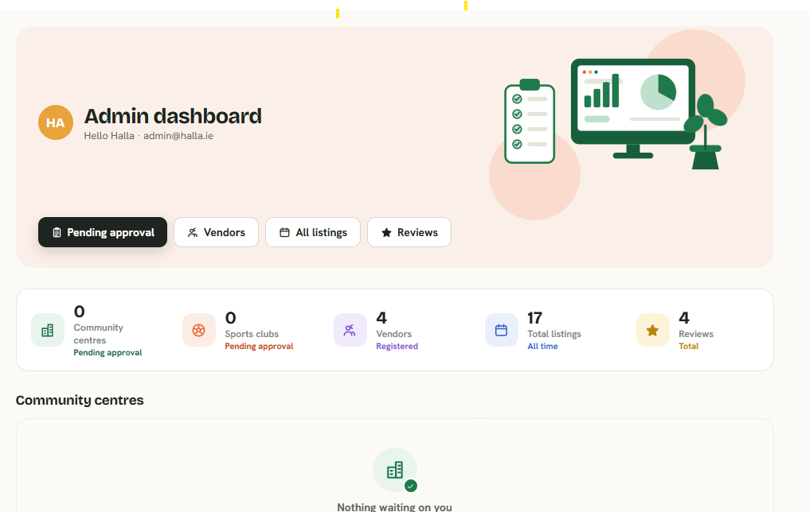

# Hello Circle — Roles & Flows

Current state: no accounts at all. Anyone can browse, book a room, or register a
child for a club; "My bookings" is just scoped by a random id in `localStorage`
(`client/src/clientId.ts`). This doc lays out what changes once we add three
roles: **User**, **Vendor**, **Admin** (you, the app owner).

---

## 1. Roles

| Role | Who | Account needed? |
|---|---|---|
| User | Public visitor booking a room or registering for a club | No (same as today) |
| Vendor | Runs a community centre and/or sports club, lists it on Hello Circle | Yes |
| Admin | You — owns the platform | Yes (one account, or a small allow-list) |

---

## 2. User flow (unchanged) — guest, no login

- Browse centres/clubs, view details, book a room or register for a club.
- No login required — stays a guest the whole way through. "My bookings" is
  scoped by the existing `X-Client-Id` header (random id in `localStorage`),
  not an account.
- **At submission time** (booking a room / registering a child), the form
  already collects and stores their real details per-record — this doesn't
  change: name, email, phone, notes for a booking; child + guardian details,
  address, emergency contact, medical info for a club registration (see
  `Booking` / `Registration` in `server/src/types.ts`). That data lives on
  the booking/registration row itself, just not linked to a persistent account.
- **Leave a rating + review** on a centre/club — no login needed, but only
  after actually booking that centre or registering for that club (checked
  server-side against their `X-Client-Id`). Anyone can still read reviews
  without having booked. See §6.
- Never sees vendor or admin screens.

---

## 3. Vendor flow

**Sign up / login**
- Vendor registers with email + password, picks "I run a centre" and/or "I run a
  club" (a vendor can own both types).
- New vendor accounts start as `pending` until an admin approves them
  (prevents randoms from listing fake venues).

**Vendor dashboard** (only sees their own listings)
- **Create** a new Centre or Club listing (name, area/county, blurb, amenities/includes,
  pricing, capacity/ages, phone).
- **Upload photos** for the listing (and per-room photos for a centre). Today
  `image` is just a URL string with no upload endpoint — this needs a real
  upload (file → stored asset → URL), see open questions below.
- For a Centre: **add/edit/delete Rooms** under it (name, capacity, rate, description).
- **Edit** any field of their own listing.
- **Delete** their own listing (or a room within it) — soft-delete recommended
  so existing bookings/registrations against it aren't orphaned.
- **View bookings/registrations** made against their own listings only (read-only —
  contact info, date/time, guest count, etc.). No visibility into other vendors' data.
- New listings (and edits to key fields like pricing?) go in as `pending`
  until admin approves — decide below whether edits also need re-approval or
  only brand-new listings do.
- **See reviews** left on their own listings (read-only — can't edit or delete
  a guest's review, only flag it for admin if it's abusive/spam).

**What a vendor can never do**
- See or touch another vendor's listings, bookings, or account.
- Approve their own listing.
- Access platform-wide data (all vendors, all bookings, revenue totals).

---

## 4. Admin flow (you)

**Login**
- Single admin account (or a short allow-list of admin emails), separate from
  vendor accounts.

**Admin dashboard**
- **Vendor management**: view all vendor accounts, approve/reject new
  signups, suspend/delete a vendor (cascades to their listings, or blocks new
  bookings but keeps history — decide below).
- **Listing moderation**: queue of pending Centres/Clubs/Rooms awaiting
  approval; approve, reject with a reason, or edit-then-approve.
- **Full CRUD on everything**: create/edit/delete any Centre, Club, or Room —
  including ones owned by a vendor (e.g. to fix a typo or take down a listing).
- **Upload/manage media** platform-wide (e.g. homepage featured images,
  or fixing a vendor's broken photo).
- **View all bookings and registrations** across every vendor, with filters
  (by centre/club, date range, vendor).
- **Feature/promote** listings on the homepage (optional, nice-to-have).
- **Moderate reviews**: delete/hide a review (spam, abuse), across any listing.
- Everything a vendor can do, for every vendor's listings, plus the
  approve/reject/suspend actions vendors don't get.

---

## 5. Data model changes this implies

- New `users` table: `id, email, passwordHash, role (user_n/a | vendor | admin), status (pending|approved|suspended), createdAt`.
  (Public "User" role doesn't need a row at all — only vendor/admin need accounts.)
- `centres` and `clubs` gain: `vendorId`, `status (pending|approved|rejected)`.
- `rooms` — no owner needed directly (inherits from parent centre), but
  create/edit/delete needs to check the request's vendorId against the centre's `vendorId`.
- Real image upload: a `/api/uploads` endpoint storing files (disk for now,
  swappable later) and returning a URL, replacing the current plain `image: string` field
  that just points at hotlinked stock photos.
- Auth: sessions or JWT + a `X-Client-Id`-style header replacement for
  vendor/admin requests; middleware to check role + ownership on every
  vendor-scoped route.
- New `reviews` table: `id, listingType (centre|club), listingId, clientId, name,
  rating (1-5), comment, createdAt, hidden (bool, for admin moderation)`.
  The static `rating`/`reviews` fields on `Centre`/`Club` go away — the API
  computes `avgRating` and `reviewCount` from this table on every read
  (or via a cheap aggregate query / trigger-maintained cache column later
  if it gets slow).
- No messaging feature/table — guest↔vendor messaging was considered and
  explicitly dropped (see §6). Guests reach a vendor by booking/registering;
  there's no separate inbox.

---

## 6. Ratings & reviews (verified stay required)

- A guest can leave a star rating (1–5) + comment on a centre or club, but
  **only after they've actually booked that centre or registered for that
  club** — checked server-side by matching their `X-Client-Id` against a real
  `bookings`/`registrations` row for that listing. Anyone can still browse
  and read reviews without having booked; only *posting* one is gated.
- The rating shown on every card/detail page is **fully computed live** from
  real submitted reviews (average + count) — listings with zero reviews show
  "no reviews yet" rather than a fake number.
- Admin can hide/delete a review (moderation); vendors can flag one for
  admin but not remove it themselves.
- **Messaging was explicitly dropped**: an earlier draft of this doc included
  a guest↔vendor "ask a question" inbox. It was built, then removed by
  request — reviews plus the existing booking/registration contact details
  are considered sufficient for now.

---

## 7. Open questions before implementation

1. Do vendor **edits** to an already-approved listing need re-approval, or
   only brand-new listings?
2. When a vendor is suspended/deleted, do their listings disappear
   immediately, or stay visible with existing bookings honored?
3. Can a guest edit or delete their own review later (e.g. via a link sent to
   their email), or is it one-shot and only admin can remove it?
